# 🏥 Hospital Lakehouse Platform (HIS-Lakehouse)

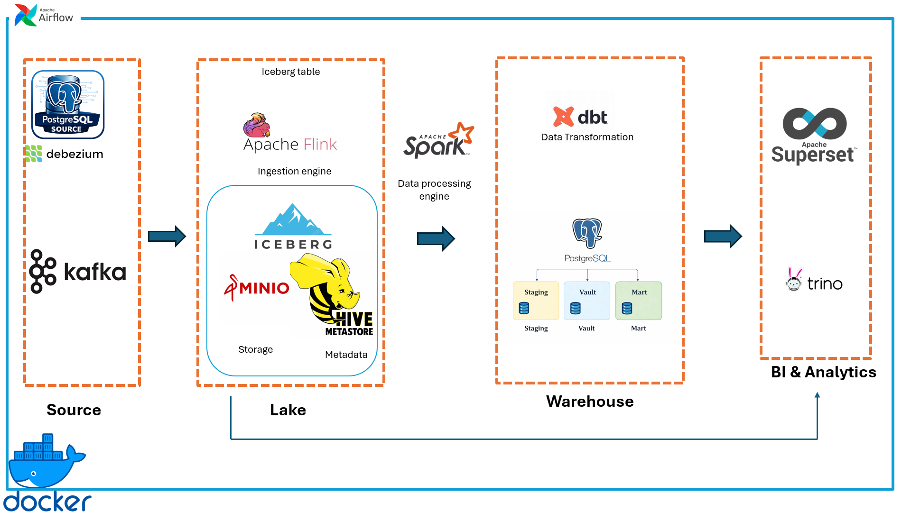

## 📖 Overview


This project builds a modern Data Warehouse system for a hospital, applying the **Medallion Architecture** combined with **Data Vault 2.0**. The system supports real-time data processing (Real-time CDC), batch processing, and enterprise search/log analytics powered by **Elasticsearch + Kibana** to provide intelligent business intelligence (BI) reports.

---

## 🏗️ System Architecture


The system is designed with a distributed model, divided into 4 main layers:

### 🚀 Data Processing Strategy

The system operates on a hybrid processing model to ensure both speed and consistency:
*   **Real-time Streaming (CDC)**: Changes from the Source DB are captured by Debezium, streamed through Kafka, and processed by **Apache Flink** into the Iceberg Lake in near real-time.
*   **Batch & Incremental Processing**: **Apache Spark** periodically transforms and moves data from the Lake into the Warehouse using **dbt**, building a robust Data Vault 2.0 structure.
*   **Direct Lake Querying**: **Trino** provides a high-performance SQL engine to query data directly on the **Iceberg Lake** without data movement, enabling fast exploration of raw and staging data.

---

## 🛠️ Tech Stack

| Component | Technology | Purpose |
| :--- | :--- | :--- |
| **Ingestion** | Debezium, Kafka | CDC data from source systems (HIS) |
| **Stream Processing** | Apache Flink | Ingest data from Kafka into Iceberg Tables |
| **Storage (Data Lake)** | Apache Iceberg, MinIO | High-performance table storage with ACID support |
| **Data Processing** | Apache Spark | Data processing (Batch & Incremental) from Lake to Warehouse |
| **Transformation** | dbt (data build tool) | Build Data Vault 2.0 & Dimensional Models |
| **Query Engine** | Trino | Direct querying on Data Lake |
| **Search & Analytics** | Elasticsearch, Kibana | Full-text search, log analysis, and operational analytics |
| **Orchestration** | Apache Airflow | Pipeline scheduling and workflow management |
| **Visualization** | Apache Superset | Operational & Financial BI Dashboards |

---

## 🌟 Key Features

-   **⚡ Real-time CDC Ingestion**: Capture every change from Source DB (HIS) using Debezium and stream it into the Data Lake via Kafka & Flink.
-   **❄️ ACID Data Lake**: Built on **Apache Iceberg** and **MinIO**, supporting concurrent reads/writes and time-travel queries.
-   **🏗️ Data Vault 2.0 Modeling**: Robust warehouse design with Hubs, Links, and Satellites to handle historical data and high scalability.
-   **📊 Modern BI Integration**: Dynamic dashboards on Apache Superset reflecting real-time and historical hospital performance.
-   **🔎 Enterprise Search & Log Analytics**: Elasticsearch + Kibana supports fast full-text search, document lookup, and centralized log analysis across the HIS platform.
-   **🔔 Automated Monitoring**: Real-time pipeline tracking with **Airflow** and instant failure/success alerts via **Slack**.


---

## 📂 Project Structure

```text
HOSPITAL_DWH/
├── infrastructure/           # Docker Compose setup for each cluster
│   ├── 1_source/             # Source DB, Kafka, Debezium
│   ├── 2_lake/               # Flink, MinIO, Hive Metastore, Trino
│   ├── 3_warehouse/          # Spark, dbt, Warehouse Postgres
│   └── 4_bi/                 # Apache Superset
├── orchestration/            # Airflow DAGs and Tasks
│   └── airflow/
│       └── dags/
│           ├── 01_Ingestion/ # CDC & Flink Pipelines
│           ├── 02_Lake/      # Data Lake Processing Pipelines
│           ├── 03_Warehouse/ # Spark & dbt Pipelines
│           └── elastic/      # Elasticsearch Continuous Streaming Pipelines
├── docs/                     # Detailed documentation
├── .env                      # Environment configuration
└── README.md                 # This file
```

---

## 🚀 Deployment

The system is fully containerized and easy to deploy. Please refer to the step-by-step detailed guide for installation, operation, and access links:

👉 **[Detailed Setup Guide](docs/setup_guide.md)**

### 🌍 Access Portal
The system is deployed on a VPS; you can access the primary services directly here:

> [!IMPORTANT]
> ### 🚀 **PRIMARY ENTRY: [BI PORTAL](http://vmi3040316.contaboserver.net:18083/)**
> 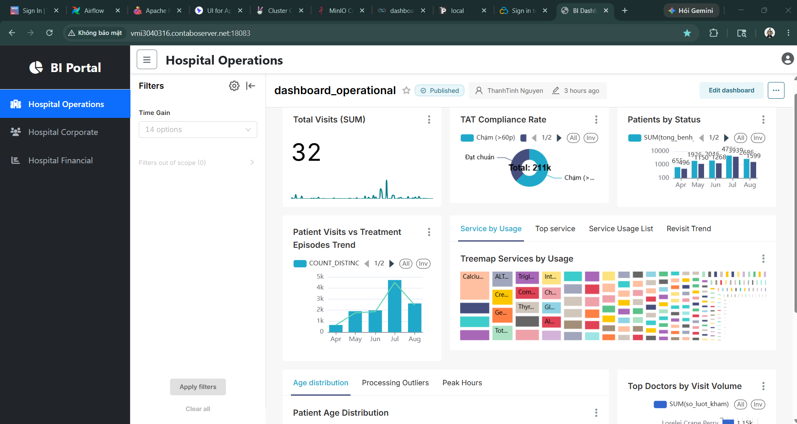
> This is the unified dashboard portal. All users should start here.
> 
> **Login Credentials (2-Layer Security):**
> 1. **Layer 1 (Browser Basic Auth):** User: `guest` | Pass: `thanhtinh@Pass1`
> 2. **Layer 2 (Viewer Account):** User: `Viewer` | Pass: `passviewer` (Required to view dashboards)

---

### 🔗 Quick Access Links

#### ✅ Public Services (Externally Accessible)
| Service | Tool | URL | Access Note |
| :--- | :--- | :--- | :--- |
| **Data Portal** | **BI Portal** | [Access Here](http://vmi3040316.contaboserver.net:18083/) | Unified dashboard interface |
| **Search Analytics** | **Kibana** | [Access Here](http://vmi3040316.contaboserver.net:5601/) | Elasticsearch analytics & dashboarding |
| **Documentation** | **DWH Docs** | [View Docs](http://vmi3040316.contaboserver.net:18183/) | Data definitions & Lineage |

#### 🔒 Internal Services (Firewall Protected - Admin Only)
*The following services are protected by a firewall and can only be accessed via the internal network or VPN:*

| Category | Tool | Port | Status |
| :--- | :--- | :--- | :--- |
| **Orchestration** | Airflow UI | `18888` | Restricted |
| **Object Storage** | MinIO Console | `19001` | Restricted |
| **Query Engine** | Trino UI | `18080` | Restricted |
| **Data Processing** | Spark Master | `18085` | Restricted |
| **Streaming** | Kafka UI | `18090` | Restricted |

---


---

## 🛠️ Additional Technical Documents
- [**Data Vault 2.0 Documents**](docs/modeling/data_vault_documents.md): Detailed Hub/Link/Sat design for hospital data.

---

## 📊 Data Modeling

The system implements the **Data Vault 2.0** methodology in the Warehouse layer to ensure scalability and historical data tracking:
- **Raw Vault**: Hubs, Links, Satellites (Raw storage from source).
- **Business Vault**: Applied hospital business logic.
- **Data Mart**: Star Schema (Fact & Dimension) for BI reporting.

---

## 🖼️ System Showcases

### 1. Data Modeling & Documentation (dbt)
The warehouse is built using **Data Vault 2.0** for flexibility and scalability. All models are automatically documented and lineage is tracked.

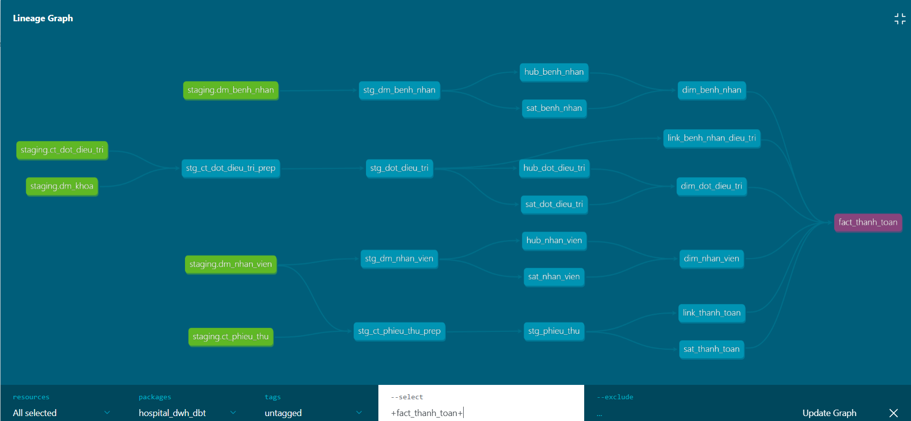

👉 **[Explore Interactive Lineage & Documentation](http://vmi3040316.contaboserver.net:18183/)**

*   **Detailed Modeling Docs**: See [Data Vault 2.0 Documents](docs/modeling/data_vault_documents.md) for entity definitions.

### 2. Business Intelligence Dashboards (Superset)
End-to-end analytics providing insights into hospital operations, finance, and corporate health checkups.

**🏥 Operational Dashboard**
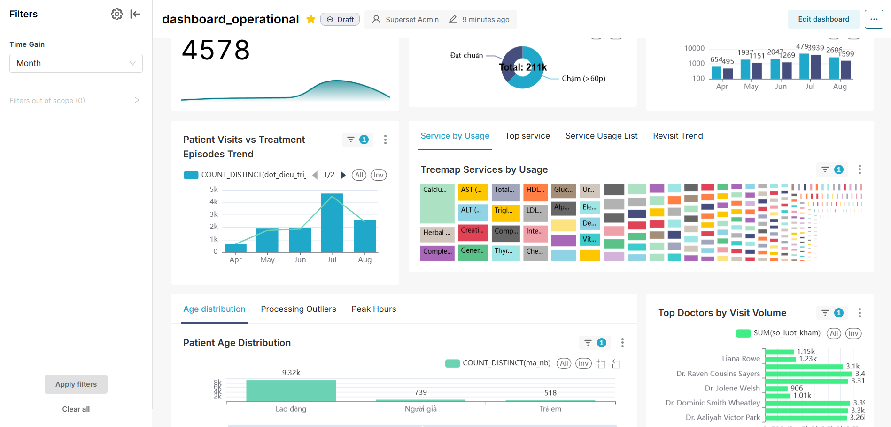

**💰 Financial Dashboard**
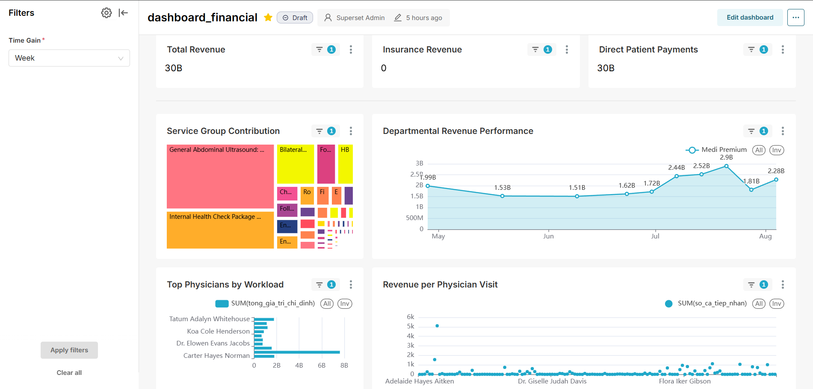

**🏢 Corporate Dashboard**
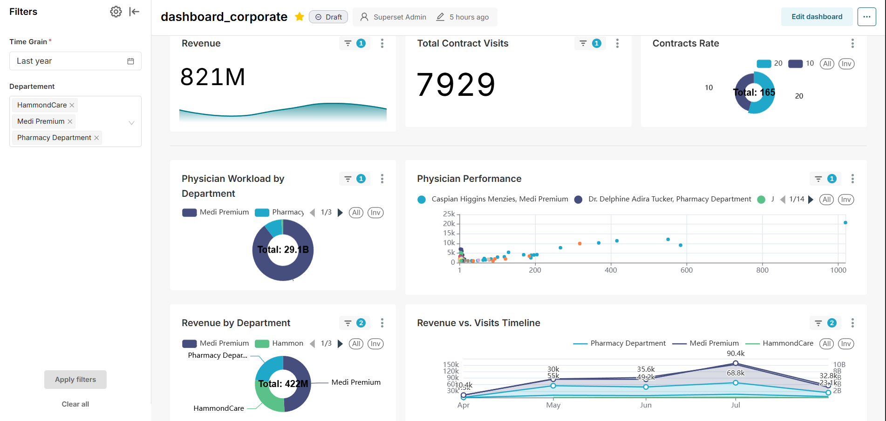


### 3. Pipeline Orchestration & Monitoring (Airflow & Slack)
The entire workflow is orchestrated by Airflow, with real-time failure alerts and success notifications integrated into Slack.

**⚙️ Airflow DAGs Management**
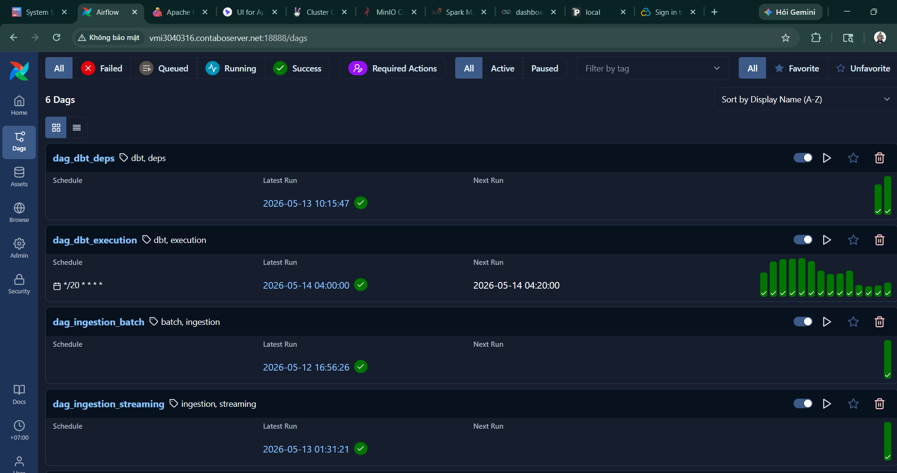

**🔔 Slack Notifications**
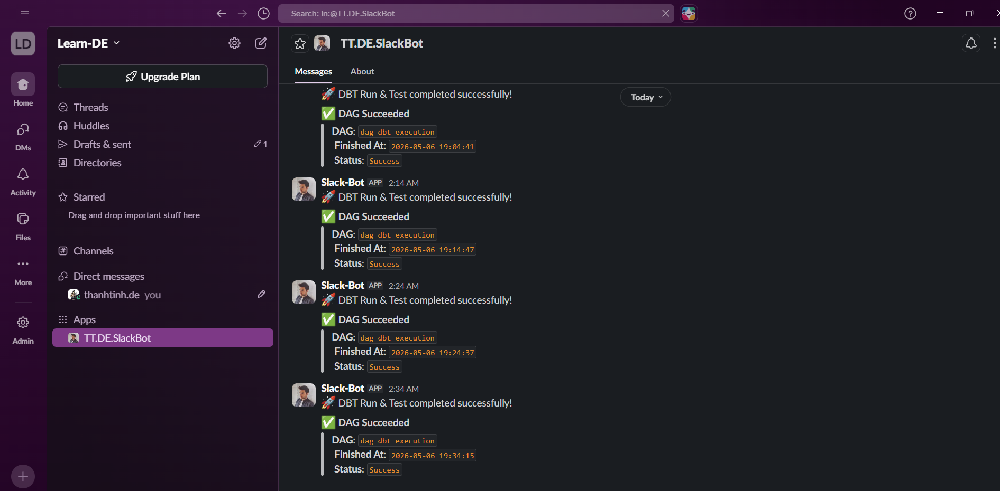


### 4. Processing Engines & Querying (Spark, Flink, Trino)
*   **Stream Processing (Flink)**: High-performance CDC ingestion from Kafka into Apache Iceberg tables.
    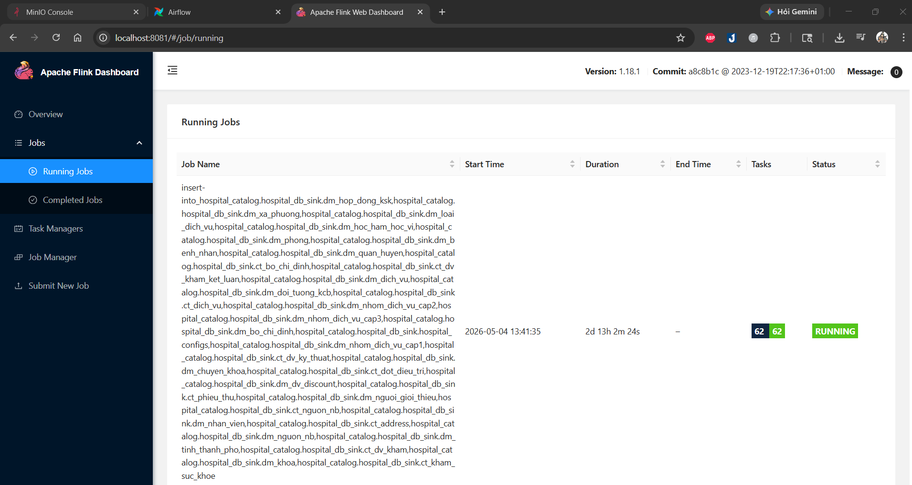
*   **Continuous Streaming (Spark)**: 24/7 Spark Continuous Streaming jobs syncing data from Iceberg directly to Elasticsearch for near-real-time search.
    
*   **Query Engine (Trino)**: Distributed SQL engine for fast, ad-hoc querying of the Data Lake.
    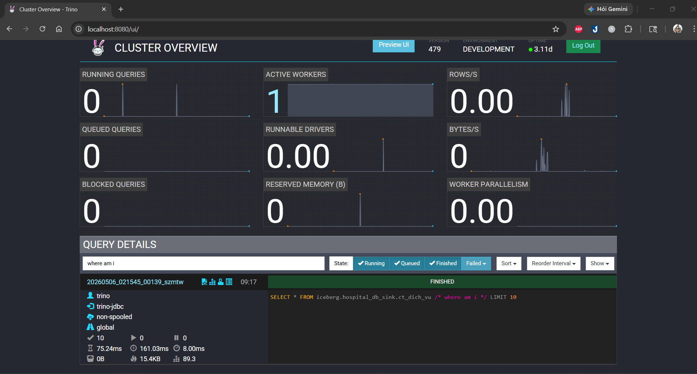
*   **Data Lake Storage (MinIO)**: Distributed object storage for Apache Iceberg tables, acting as the foundation of the Medallion architecture.
    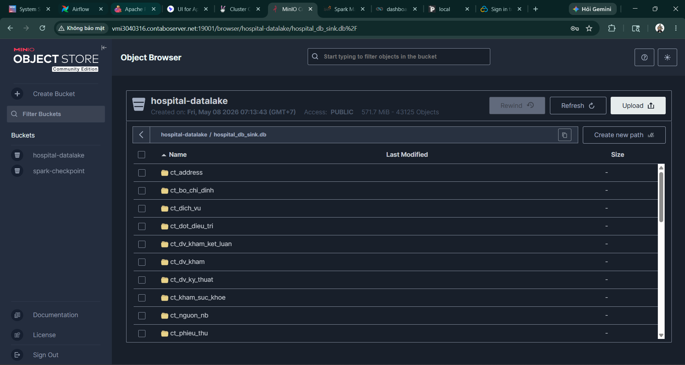

### 5. Network & Security (WGDashboard)
Secure access to the infrastructure is managed via WireGuard VPN, with a centralized dashboard for peer management.

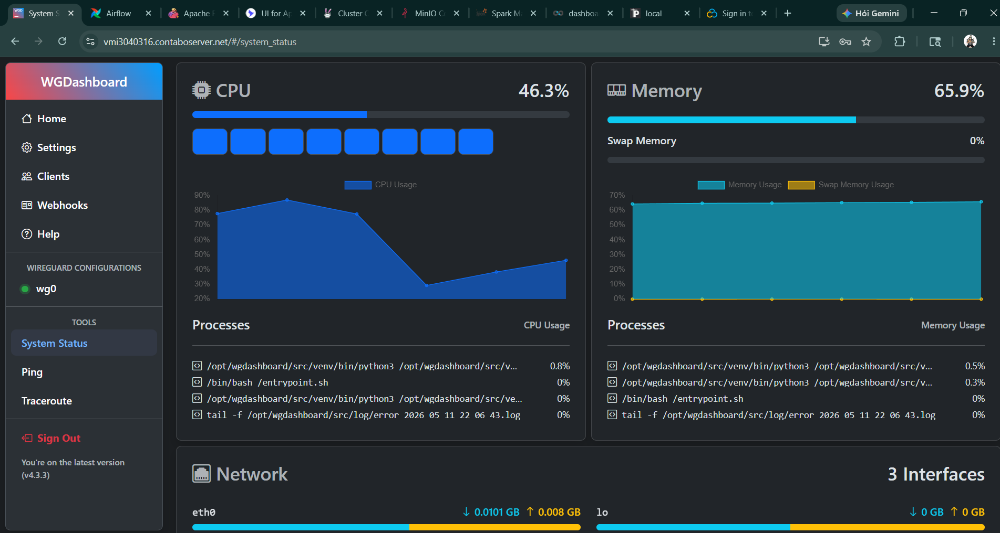

### 6. Enterprise Search & Analytics (Elasticsearch & Kibana)
An intelligent search system supporting rapid patient lookup, service catalog auto-completion, and centralized log analysis. The Kibana dashboard provides real-time monitoring of search performance and cluster health.

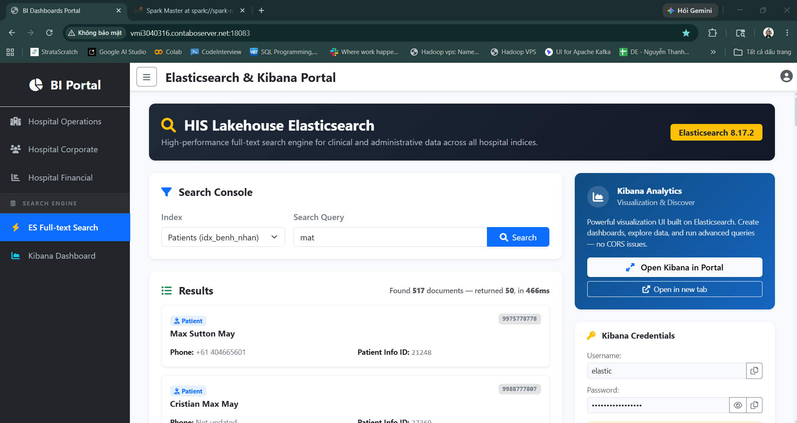

---

## 📝 Contact
- **Project Lead**: Nguyễn Thanh Tính
- **Phone**: 0917 026 597
- **Email**: thanhtinh.de@gmail.com
- **Git**: https://github.com/OLD-SILVER-org
- **Zalo**: https://zalo.me/0917026597
- **Version**: 1.0.0
